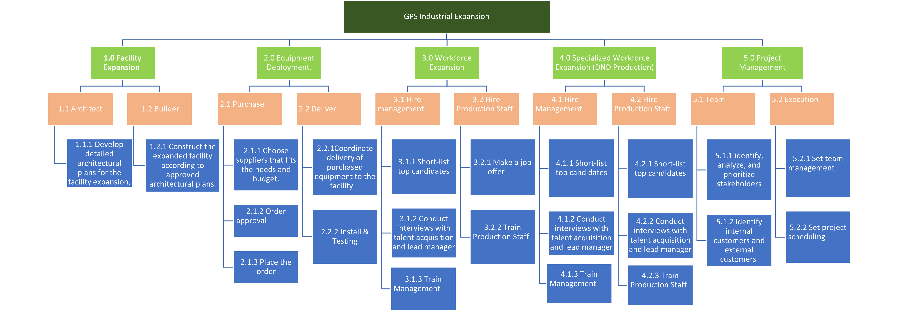

# Big Title
## Smaller Title
### Even smaller title
*This is a sentence*
***This is my test***
>A quote
- Point 1
    - Point 2
        - Point 3
1)
2)
3)

This piece of code is an `int`.
...
if this:
    then that
...

